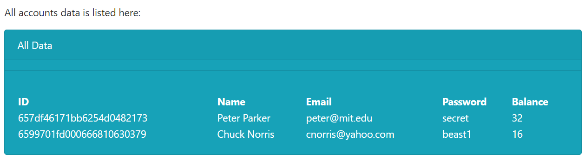

<!-- Table for displaying images in a row -->
<table>
  <tr>
    <td></td>
  </tr>
</table>
<table>
    <td></td>
    <td></td>
    <td></td>
    <td></td>
    <td></td>
  </tr>
</table>
<table>
  <tr>
    <td></td>
  </tr>
</table>

# **Project Name**
Bad Bank app - the 5th iteration: a Three Tier Bank 

** This version of my code does not work - I moved index.js to "src" folder and I can't figure out where in my code or in which file the path is now wrong. 1/11/24 KR

-- the rest of this README needs to be edited yet. --

# **Description**: 
The Three Tier Bank project, a three tier Next.js app, initiates on the home page, with a welcome message and security warning. The first step would be to "Create Account" on its Register page or "Login" on its Login page. Once logged in, the user can "Deposit" or "Withdraw" or view his/her account "Balance." Unfortunately the account balance is not linked across pages at this time. On the final page, one can see "AllData" transactions.

The Three Tier Bank project will likely be deployed via Amazon Web Service S3 bucket and can be accessed here to see its capabilities: link coming soon.

This iteration of the project has outdated code, incompatible with the latest version of React node.js. I used node.js version 16.20.1 on my local machine to make it work.

The following Validation was employed:
* All submit buttons are disabled until all the fields have input.
* Email input fields on the Login and Create Account pages require correct email format, otherwise a warning will appear.
* Password input fields on the Login and Create Account pages require 8 or more characters.
* Both Deposit and Withdraw input fields require positive integers, otherwise a warning will appear.
* The Withdraw input cannot exceed the account balance, otherwise an overdraft warning will appear.

Some Features employed:
* When hovering over the NavBar, a title appears explaining what each page is/does. 
* Beware - Account Balance is NOT maintained across pages.
* Each page has a different color card/content to further distinguish its purpose.

The Three Tier Bank project is an example of the following skills and capabilities: routing, context, tracking state, event handling, and parent/child relationships. I employed Bootstrap and CSS for styling, as well as HTML5, JavaScript, and JSX. As such, this project is one component of my professional portfolio. This particular project is based off of a similar activity I worked on in September through December of 2023 from Modules 18, 19, 26, Portfolio II, and the Capstone Project in the MIT xPro via Emeritus bootcamp I was enrolled in called "Professional Certificate in Coding: Full Stack Development with MERN."

# **Dependencies**: 
The project relies on the following dependencies: ReactJS, Bootstrap, Babel, Express, NodeJS, MongoDB. Note: I am using an outdated versions: React v16, NodeJS 16, npm 6.14.18.

# **Usage**: 
To duplicate my project and run your own version, download the files onto your machine or clone the repo. 

** Make adjustments to the app:
* Go to FireBase and create a project with a web app. 
* In Firebase, Build Authentication. 
* In Firebase, generate a new private key by going to Project settings and clicking on the Service Accounts tab.
* Save the file in your desired location on your computer (where you save all your keys). Do not share this key! Copy the contents for the next step.
* In the project directory, create a file named something similar to "AuthRoutes.json" and place the private key contents into this new file. Save.
* If you did not name your file in the last step AuthRoutes.json, then go into the admin.js file and enter your file name in/near line 5. Save.
* Now is a good time to create a .gitignore file for the project and add these contents: /node_modules/ and AuthRoutes.json. Save.
* In Firebase, go to Project Settings and click on the General tab. Copy the configuration, which starts with "const firebaseConfig = {
  apiKey:."
* In the login.js file at the root folder, place your unique configuration (into the firebaseConfig variable). Save.

** Run the app: 
* In your terminal navigate to the project's root directory, above the public folder.
* Type terminal command: npm install
* On AtlasDB, create an account.
* On AtlasDB, create a database (choose the free option).
* On AtlasDB, create a cluster.
* On AtlasDB, Connect to cluster (via Driver).
* On AtlasDB, create a collection called 'users' (within target cluster, click on add data/create db/ & name db 'myproject' & name collection 'users')
* On AtlasDB, click on Network Access (in left menu). Notice your IP address. Add another address: 0.0.0.0/0 
* Copy the Connection String (unique to you-don't share.) (Connection String format: mongodb+srv://<username>:<password>@<cluster-name>.<jibberish>.mongodb.net/?retryWrites=true&w=majority)
* In dal.js on/near line 3, substitute your Connection String for the const url.
* In MongoDB Compass, ensure that you have a database called myproject and a collection called users.
* In MongoDB Compass, Create a New Collection. In the URI field, place your Connection String.
* Type terminal command:  node index.js
* In your browser, navigate to address: localhost:3000 to run on your local server.

* Deploy on something like Heroku or SW3 bucket

* If you want to employ mongo_test.js, ensure that your MongoDB server is running on localhost:27017 and that you have the 'myproject' database created with a 'customers' collection before running the script. Type terminal command: node mongo_test.js.

# **Support**: 
Please contact me via email at krentmeester@uwalumni.com.

# **Roadmap**: 
Future fixes or improvements that would be helpful to a user:

* Make the Deposit, Withdraw, and AllData pages only visible upon logging in.
* Track the account balance across all pages 
* Track the account balance even after logging out
* Once logged in, transport the user to an account page where all accounts are visible
* Once an account is created, transport the user to an account page where all accounts are visible
* Remove the AllData page
* NavBar tab is highlighted for the active page
* Add additional security - biometrics, or two-factor authentication for authentication (instead of only username & password).
* Add Show/ Hide password toggle option
* Add transaction history
* Add additional sign-on methods
* Add different types of accounts (ex/ savings, checking)

# **License**: 
MIT License

Copyright (c) 2023 Kerri Rentmeester

Permission is hereby granted, free of charge, to any person obtaining a copy of this software and associated documentation files (the “Software”), to deal in the Software without restriction, including without limitation the rights to use, copy, modify, merge, publish, distribute, sublicense, and/or sell copies of the Software, and to permit persons to whom the Software is furnished to do so, subject to the following conditions:

The above copyright notice and this permission notice shall be included in all copies or substantial portions of the Software.

THE SOFTWARE IS PROVIDED “AS IS”, WITHOUT WARRANTY OF ANY KIND, EXPRESS OR IMPLIED, INCLUDING BUT NOT LIMITED TO THE WARRANTIES OF MERCHANTABILITY, FITNESS FOR A PARTICULAR PURPOSE AND NONINFRINGEMENT. IN NO EVENT SHALL THE AUTHORS OR COPYRIGHT HOLDERS BE LIABLE FOR ANY CLAIM, DAMAGES OR OTHER LIABILITY, WHETHER IN AN ACTION OF CONTRACT, TORT OR OTHERWISE, ARISING FROM, OUT OF OR IN CONNECTION WITH THE SOFTWARE OR THE USE OR OTHER DEALINGS IN THE SOFTWARE.